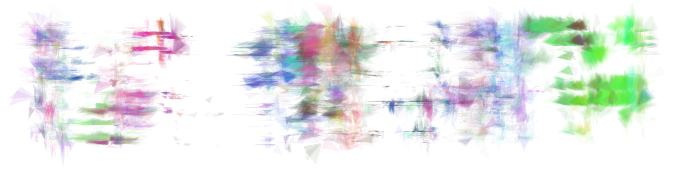

##GA Triangles

A personal art project: create images from genetic algorithms.

---
####Dependencies
JRE 1.8+

[simpleGAvis](http://github.com/0la0/simpleGAvis)

[json simple](http://github.com/fangyidong/json-simple)

---
####Usage
Create a model and thumbnail image by running GaToFile.java.  If the user chooses, the model will be saved in files/models and the thumbnail will be saved in files/thumbs.

Create a refined image from an existing model by running ImageFromJson.java.  Configure image parameters with a JSON file in the imageDescriptioins directory.